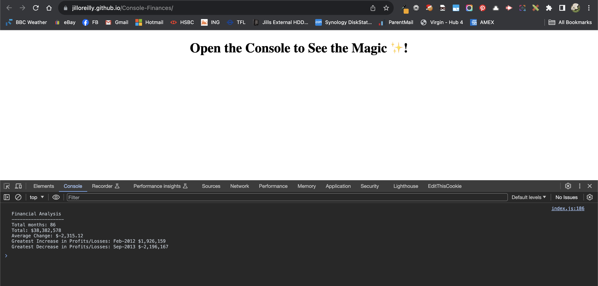

# Console-Finances
Challenge 4 - Javascript - Front-end Web Dev Bootcamp

## Description

This portfolio webpage showcases the front-end development skills I have gained through the Front-end web development bootcamp provided by EdX as well as my previous work as a web developer. This webpage has been refactored using the Bootstrap CSS Framework.

## Usage

1. The Console-Finances webpage can be accessed online on Github pages: [https://jilloreilly.github.io/Console-Finances/](https://jilloreilly.github.io/Coonsole-Finances/)
2. Right-click on the page and select **"Inspect"** from the menu. This will open the Web Developer Toolbar      

3. In the Web Developer Toolbar, click on **"Console"** and you will see the resulting output of the Javascript

## Credits

Thank you to the following: 

- W3C Schools for [CSS variables](https://www.w3schools.com/css/css3_variables.asp), [CSS combinators](https://www.w3schools.com/css/css_combinators.asp)

## License

MIT License

Copyright (c) 2023 Jill O'Reilly

Permission is hereby granted, free of charge, to any person obtaining a copy
of this software and associated documentation files (the "Software"), to deal
in the Software without restriction, including without limitation the rights
to use, copy, modify, merge, publish, distribute, sublicense, and/or sell
copies of the Software, and to permit persons to whom the Software is
furnished to do so, subject to the following conditions:

The above copyright notice and this permission notice shall be included in all
copies or substantial portions of the Software.

THE SOFTWARE IS PROVIDED "AS IS", WITHOUT WARRANTY OF ANY KIND, EXPRESS OR
IMPLIED, INCLUDING BUT NOT LIMITED TO THE WARRANTIES OF MERCHANTABILITY,
FITNESS FOR A PARTICULAR PURPOSE AND NONINFRINGEMENT. IN NO EVENT SHALL THE
AUTHORS OR COPYRIGHT HOLDERS BE LIABLE FOR ANY CLAIM, DAMAGES OR OTHER
LIABILITY, WHETHER IN AN ACTION OF CONTRACT, TORT OR OTHERWISE, ARISING FROM,
OUT OF OR IN CONNECTION WITH THE SOFTWARE OR THE USE OR OTHER DEALINGS IN THE
SOFTWARE.

## Technologies Used

